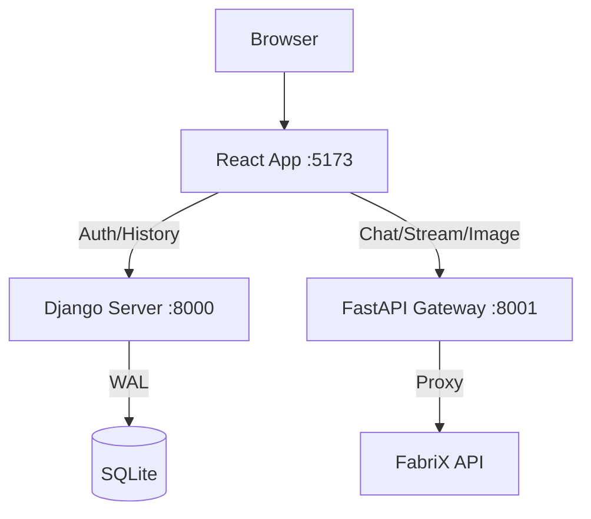

# FabriX Agent Chat Interface

Windows 환경에서 실행되는 보안 중심의 local LLM 채팅 서비스입니다. Samsung SDS FabriX API를 활용하여 기업 내부망에서 안전한 AI 인터페이스를 제공합니다.

## 1. 프로젝트 개요
- **목표**: 보안성이 강화된 사내용 AI 채팅 서비스 구축 (Production-Ready)
- **핵심 특징**:
  - Django(인증/상태)와 FastAPI(AI 스트리밍)를 조합한 하이브리드 백엔드
  - React + Vite 기반의 고성능 프론트엔드
  - SQLite WAL 모드 및 Connection Pooling을 통한 동시성 최적화
  - `secrets.toml`을 통한 민감 정보 분리 및 보안Proxy 아키텍처

## 2. 기술 스택
- **Frontend**: React 18, Vite, Tailwind CSS, Lucide React, Axios
- **Backend**: 
  - **Service A (Django 5.0)**: 인증, 사용자/채팅 세션 관리, 데이터 영속성
  - **Service B (FastAPI)**: AI Gateway, SSE 스트리밍, Rate Limiting, 이미지 분석
- **Database**: SQLite 3 (WAL 모드 활성화)
- **Runtime**: Python 3.10+, Node.js 18+

## 3. 시스템 아키텍처

## 4. 디렉토리 구조
- `ai_gateway/`: FastAPI 기반 AI Proxy 및 스트리밍 로직
- `django_server/`: Django 기반 modular apps (authentication, core, fabrix_agent_chat, image_inspector)
- `frontend/`: React 소스 코드 및 Vite 빌드 설정
- `docs/`: 기술 설계 및 가이드 문서

## 5. 설치 및 실행 (Windows)
1. **초기 설정**: `setup_project.bat` 실행 (가상환경 생성, 의존성 설치)
2. **비밀 설정**: `secrets.toml` 생성 및 API Key/Secret Key 설정
3. **DB 초기화**: `reset_create_admin.bat` 실행 (DB 생성 및 superuser 생성)
   - **중요**: 이 단계를 건너뛰면 브라우저에 흰 화면만 표시됩니다
4. **실행**: 
   - 개발 모드: `run_project.bat` (localhost 접속)
   - 서비스 모드: `service_project.bat` (사내망 IP 노출)

## 6. 주요 기능 및 성능 개선
- **Modular Apps**: 인증, 코어, 채팅, 이미지 분석 기능을 독립적인 Django App으로 분리하여 확장성 확보
- **Connection Pooling**: `httpx`를 사용한 외부 API 연결 재사용으로 응답 속도 개선
- **DB 최적화**: `select_related`, `prefetch_related` 및 Composite Index 적용으로 N+1 문제 해결
- **안정성**: 지수 백오프 기반 Retry 로직 및 원자적 트랜잭션 보호

---
*상세 개발 지침은 `GEMINI.md`를 참조하세요.*