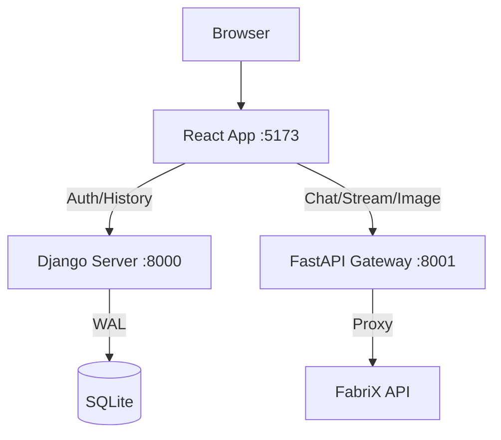

# FabriX Agent Chat Interface

Windows 환경에서 실행되는 보안 로컬 LLM 채팅 서비스입니다. 삼성 SDS의 FabriX API를 프론트엔드 인터페이스와 연결하여 사내 네트워크 내에서 안전하게 AI와 상호작용할 수 있는 환경을 제공합니다.

## 1. 프로젝트 주요 특징
- **보안 중심**: 외부로 노출되지 않는 사내 API 프록시 패턴 및 secrets.toml을 통한 키 관리
- **하이브리드 아키텍처**:
  - Django (사용자/권한/채팅 이력 관리)와 FastAPI (AI 스트리밍/고성능 프록시)의 결합
  - React 19 기반의 최신 프론트엔드 아키텍처
  - DuckDB 엔진을 활용한 고성능 데이터 분석 (Data Explorer)
- **로컬 최적화**: SQLite WAL 모드 및 고효율 커넥션 풀링을 통한 가벼운 배포 환경

## 2. 기술 스택
- **Frontend**: React 19, Vite, Tailwind CSS, Lucide React, Axios, Graphic-Walker
- **Backend**:
  - **Service A (Django 5.0)**: 사용자 인증, 채팅 세션 관리, 데이터 탐색기 백엔드
  - **Service B (FastAPI)**: AI Gateway (FabriX Proxy), SSE 스트리밍, 이미지 처리 및 분석
- **Database**: SQLite 3 (WAL 모드), DuckDB (데이터 분석용)
- **Runtime**: Python 3.10+, Node.js 18+

## 3. 시스템 아키텍처

## 4. 주요 기능
- **AI 채팅**: FabriX API를 통한 실시간 스트리밍 답변 및 대화 이력 저장
- **이미지 인스펙터**: 두 이미지/PDF 비교 및 ORB 기반의 유사성 분석
- **데이터 탐색기**: Graphic-Walker와 DuckDB를 결합하여 대용량 CSV 파일을 시각적으로 분석
- **관리 기능**: 사용자 기반의 채팅 세션 관리 및 데이터베이스 백엔드 도구

## 5. 설치 및 실행 (Windows)
1. **프로젝트 설정**: `setup_project.bat` 실행 (가상환경 생성 및 패키지 설치)
2. **비밀 정보 설정**: `secrets.toml` 파일을 루트에 생성하고 API Key 설정
3. **DB 초기화**: `reset_create_admin.bat` 실행 (데이터베이스 및 관리자 계정 생성)
4. **서비스 실행**:
   - 개발 모드: `run_project.bat` (localhost 접속)
   - 서비스 모드: `service_project.bat` (네트워크 외부 접속 허용)

## 6. 최근 변경사항 (2025-02-05)
- **React 19 업그레이드**: 최신 React 19 버전으로 마이그레이션 완료 및 호환성 확보
- **데이터 탐색기 개편**: PyGWalker를 대체하여 Graphic-Walker(React Native) 및 DuckDB 도입
  - 대용량 데이터 처리 속도 대폭 개선
  - iframe 없는 네이티브 React UI 구현
- **안정성 개선**: 각종 버그 수정 및 API 응답 속도 최적화

---
*상세한 개발 가이드는 `GEMINI.md`를 참고하세요.*
